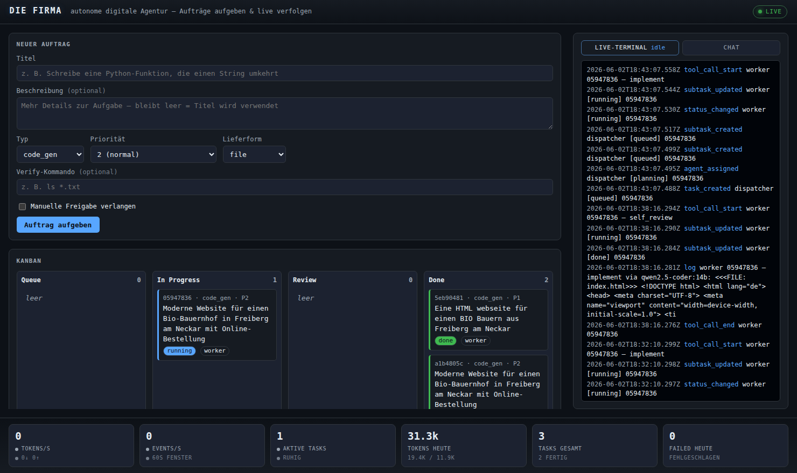
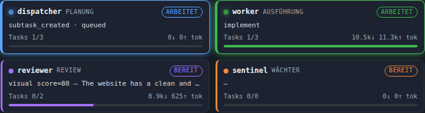
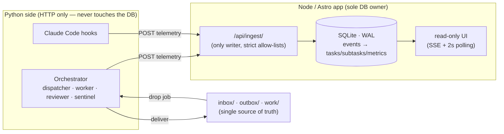

# Die Firma — autonome digitale Agentur (lokal)

A local, autonomous "digital agency" system. Drop a job as a Markdown file
into `inbox/`; the system decomposes it into a DAG of atomic sub-tasks, picks
the best local model per sub-task, runs them, **reviews and refines** the
result (text + visual critique), and delivers it to `outbox/` — fully
automatically, fully offline on [Ollama](https://ollama.com).



> The read-only dashboard: Kanban (Queue / In Progress / Review / Done), a
> colour-coded **agent monitor** showing what each agent is doing *right now*, a
> right-hand panel that toggles between a **live telemetry terminal** and a
> **chat** (with optional RAG over your deliverables), and a strip of **live
> metrics** (tokens/s, events/s, active tasks, …). Everything you see is a
> projection of the append-only event log — the agents never write a pixel of it.



> The agent monitor: each agent (`dispatcher` · `worker` · `reviewer` ·
> `sentinel`) has its own colour, a live `arbeitet`/`bereit` status, its current
> action, and a bar showing its token share relative to the busiest agent.

## The iron principle: deterministic one-way data flow

The AI agents **never render or write the dashboard**. They emit telemetry
only, via hooks. The dashboard is a **read-only projection** built from
deterministic code:



- **Exactly one process owns the DB:** the Node/Astro app. Python (orchestrator
  + worker + hooks) speaks **HTTP only** and never touches the DB directly.
- **CQRS:** filesystem = single source of truth for orchestration; SQLite is a
  pure read-model for the dashboard.
- `/api/ingest` is the **only writer** and validates strictly (allow-lists for
  `kind` / `status`).

## Architecture (locked)

- **4 core agents:** `dispatcher` (decompose → DAG, ≤2 levels), `worker`
  (execute), `reviewer` (real quality gate — see below), `sentinel` (errors,
  retry, loop-breaker).
- **Execution engine:** the **worker** runs your jobs. Pick the executor in
  `config.toml`:
  - **`ollama`** *(default)* — fully **local** via an [Ollama](https://ollama.com)
    server. No API key, no cloud, $0 cost. Generation is **streamed**, so the
    dashboard shows live tokens/s instead of one spike per call.
  - **`mock`** — deterministic, no server/key (tests, CI, `./firma demo`).
  - **`claude_code`** — headless Claude Code under `firejail` (cloud, needs a
    key). dispatcher/reviewer/sentinel can use the Anthropic SDK (tiered models).
- **Concurrency:** semaphore, start = 2 parallel tasks.
- **Retry:** 3 attempts, exponential backoff (2s/4s/8s) → `blocked` →
  `sentinel` → escalation (red flag + `notify-send`).
- **Cost guard:** hard daily USD limit; queue pauses when reached (local Ollama
  runs are free, so it never trips).
- **Delivery:** results to `outbox/<id>/`; code tasks also get a local git
  branch `feature/task-<id>` in an isolated **copy** under `work/<id>/`.

## Quality pipeline & per-task model routing

The worker doesn't just generate once and ship. Each job flows through:

1. **Model router** (`router.py`) — routes every sub-task to the best local
   model by *role*: code → `qwen2.5-coder:14b`, review → `qwen2.5:14b`,
   reasoning → `deepseek-r1:14b`, vision → `llava:7b`. On a retry it **escalates**
   to the reasoning model. Configure in `config.toml` under `[ollama.roles]`.
2. **Design-system injection** — web jobs get a strong, opinionated design brief
   (modern layout, cohesive palette, real cart/checkout, inline-SVG imagery, no
   broken ``) so the first pass already targets production quality.
3. **Real review** (`quality.py`) — a reviewer model grades the deliverable
   against a rubric and returns concrete findings; for web output a **vision
   model (`llava`) critiques a headless screenshot** of the rendered page.
4. **Generate → critique → refine loop** — findings are fed back into refine
   passes until the deliverable passes or the pass budget is spent. A
   HIGH-severity finding always forces a refine, regardless of the model's own
   verdict.

Tunable in `config.toml` (`[quality]`: `min_score`, `max_refine_passes`,
`visual`). The visual critic needs `llava` (`ollama pull llava:7b`) and
Playwright's chromium; without them the gate degrades gracefully to text-only.

## Chat with your deliverables (RAG)

The dashboard's right-hand panel toggles to a **chat** that talks to any local
Ollama model. With *Job-Kontext* enabled it answers grounded in your `outbox/`
deliverables via retrieval (embeddings with `nomic-embed-text`, only changed
files are re-embedded). All loopback-only; nothing leaves your machine.

## Repository layout

See `BUILD_PROMPT.md §3`. Top level: `inbox/ outbox/ work/ runlog/ state/`,
`apps/dashboard` (Astro/TS, owns SQLite + ingest + SSE + UI),
`services/orchestrator` (Python), `hooks/` (Claude Code hooks → ingest),
`.claude/settings.template.json`, `scripts/`, `systemd/`.

## Status

Built in phases (see `RUN_LOG.md`). Phases 0–2 (foundation, dashboard +
ingest + SSE, orchestrator core + mock E2E) are fully implemented and verified
in CI without an API key. Phases 3–5 (real Claude executor + firejail sandbox,
sentinel/cost-guard/notify, systemd operations) are implemented with graceful
degradation; the host-specific parts (firejail, real key, systemd,
`notify-send`) are documented and must be exercised on a Pop!_OS host — they
are **not** run in CI.

## Quick start — one command

You only need **Node**, **npm** and **Python 3.11+** installed. No API key, no
config, no manual setup:

```bash
git clone https://github.com/BEKO2210/Die_Firma && cd Die_Firma
./firma demo
```

That single command installs everything the first time (dashboard deps, a
Python venv, the orchestrator), **auto-generates a secure `.env` token**, builds
and starts the dashboard + orchestrator, then drops an example job so you watch
it move across the board. Open the printed URL (http://127.0.0.1:4321).

### Everyday use

```bash
./firma start                       # set up (once) + start everything
./firma new "Refactor the login flow"   # create a job — no YAML, no UUID needed
./firma submit path/to/job.md       # or drop an existing job file
./firma status                      # services + task statuses
./firma logs                        # follow the live logs
./firma stop                        # stop both services
```

`./firma new` accepts `--type {code_gen|code_review|automation|data_prep}`,
`--priority {1,2,3}`, `--deliverable {git_branch|file|report}`, `--verify "cmd"`
and `--approve`. Priority‑1 / `--approve` jobs wait for `./firma approve <id>`.

### Run it fully local with Ollama (default, no API key)

The default executor is **`ollama`** — everything runs on your machine, free.

```bash
# 1) Install Ollama (https://ollama.com) and pull a model
ollama pull llama3.2          # general — or: ollama pull qwen2.5-coder (code)

# 2) Start Die Firma — it detects Ollama and uses it automatically
./firma start
./firma new "Write a Python function that reverses a string"
```

`./firma start` runs a preflight: it checks the Ollama server, and pulls the
configured model if it's missing. Change the model anytime in `config.toml`
(`[ollama] model = …`) or per run via `DIE_FIRMA_OLLAMA_MODEL=…`. Because local
inference is free, the daily cost guard simply never trips.

> Just want to see the pipeline without installing a model? `./firma demo`
> forces the deterministic `mock` executor — instant, no Ollama, no key.

<details>
<summary>Manual / advanced (without the launcher)</summary>

```bash
./scripts/setup.sh                  # install deps + create .env
# Dashboard:    cd apps/dashboard && npm run build && npm run preview
# Orchestrator: cd services/orchestrator && python -m die_firma.cli run
```

Full reproducible end-to-end (resets DB, seeds fresh, asserts `outbox/` +
`done`): `./scripts/e2e.sh`.
</details>

## Security notes (honest, per claude.md §7)

- All services bind to `127.0.0.1` only; no auth is required while loopback-
  bound.
- No working default secrets: startup rejects known placeholders and enforces a
  minimum-entropy / format check, else it aborts.
- Workers run sandboxed under `firejail` and see only `work/<id>/` plus an
  explicit whitelist. **The sandbox has not been externally audited.**

See `DEPENDENCIES.md` for exact pinned versions (verified 2026-06-01) and known
environment gaps.

## Operations (Pop!_OS host)

Run as isolated `systemd --user` services (no root, no Docker):

```bash
loginctl enable-linger "$USER"
cp systemd/*.service ~/.config/systemd/user/
systemctl --user daemon-reload
systemctl --user enable --now die-firma-dashboard.service
systemctl --user enable --now die-firma-orchestrator.service
```

Switch to the real worker by setting `[executor] mode = "claude_code"` in
`config.toml` and providing a real `ANTHROPIC_API_KEY` in `.env`. Workers then
run as headless Claude Code under `firejail` (install it first:
`sudo apt install firejail`), seeing only `work/<id>/` plus each job's
`allowed_paths`. Escalations raise a desktop notification via `notify-send`.

## Definition of Done — status

- [x] Newest stable deps verified live (2026-06-01); `npm audit --audit-level=high`
      clean (5 moderate advisories live only in the dev-only `@astrojs/check`
      toolchain); lockfiles consistent.
- [x] Dashboard: TS strict + `noUncheckedIndexedAccess`, `astro check` 0 errors,
      vitest 48 passing (incl. axe a11y gate), build green.
- [x] Orchestrator: ruff + ruff format + mypy `--strict` clean, pytest 104
      passing at 91% (core modules 100%).
- [x] Acceptance E2E (`scripts/e2e.sh`, mock executor, no key): job in →
      processed → `outbox/<id>/` + status `done` → dashboard read API confirms.
- [x] Fresh build verified against the running server (not a stale build).
- [x] Docs (`README`, `DEPENDENCIES`, `RUN_LOG`) match the real code state;
      discrepancies vs the prompt (TS 6.0.3, Python 3.11) recorded with rationale.
- [ ] **Host-only (not verifiable in CI):** firejail sandbox, live Claude
      worker with a real key, `systemd --user` services, `notify-send`
      escalations. Implemented fail-closed; must be exercised on a Pop!_OS host.
