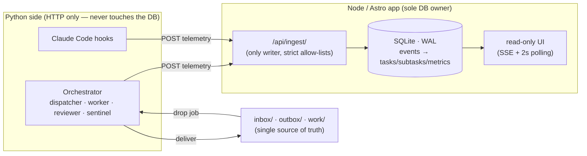

# Die Firma — autonome digitale Agentur (lokal)

A local, autonomous "digital agency" system. Drop a job as a Markdown file
into `inbox/`; the system decomposes it into a DAG of atomic sub-tasks, runs
them, validates the result, and delivers it to `outbox/` — fully automatically.


> The read-only dashboard: Kanban (Queue / In Progress / Review / Done),
> agent monitor with token & cost totals, a live telemetry terminal, and daily
> metrics. Everything you see is a projection of the append-only event log —
> the agents never write a pixel of it.

## The iron principle: deterministic one-way data flow

The AI agents **never render or write the dashboard**. They emit telemetry
only, via hooks. The dashboard is a **read-only projection** built from
deterministic code:



- **Exactly one process owns the DB:** the Node/Astro app. Python (orchestrator
  + worker + hooks) speaks **HTTP only** and never touches the DB directly.
- **CQRS:** filesystem = single source of truth for orchestration; SQLite is a
  pure read-model for the dashboard.
- `/api/ingest` is the **only writer** and validates strictly (allow-lists for
  `kind` / `status`).

## Architecture (locked)

- **4 core agents:** `dispatcher` (decompose → DAG, ≤2 levels), `worker`
  (execute), `reviewer` (test/validate), `sentinel` (errors, retry,
  loop-breaker).
- **Execution engine:** worker = Claude Code headless
  (`claude -p … --output-format stream-json`) under `firejail` with a path
  whitelist; dispatcher/reviewer/sentinel = Anthropic Python SDK (tiered
  models). An **executor abstraction** offers `mock | claude_code`; `mock` is
  deterministic and enables tests/E2E with no API key.
- **Concurrency:** semaphore, start = 2 parallel tasks.
- **Retry:** 3 attempts, exponential backoff (2s/4s/8s) → `blocked` →
  `sentinel` → escalation (red flag + `notify-send`).
- **Cost guard:** hard daily USD limit; queue pauses when reached.
- **Delivery:** results to `outbox/<id>/`; code tasks also get a local git
  branch `feature/task-<id>` in an isolated **copy** under `work/<id>/`.

## Repository layout

See `BUILD_PROMPT.md §3`. Top level: `inbox/ outbox/ work/ runlog/ state/`,
`apps/dashboard` (Astro/TS, owns SQLite + ingest + SSE + UI),
`services/orchestrator` (Python), `hooks/` (Claude Code hooks → ingest),
`.claude/settings.template.json`, `scripts/`, `systemd/`.

## Status

Built in phases (see `RUN_LOG.md`). Phases 0–2 (foundation, dashboard +
ingest + SSE, orchestrator core + mock E2E) are fully implemented and verified
in CI without an API key. Phases 3–5 (real Claude executor + firejail sandbox,
sentinel/cost-guard/notify, systemd operations) are implemented with graceful
degradation; the host-specific parts (firejail, real key, systemd,
`notify-send`) are documented and must be exercised on a Pop!_OS host — they
are **not** run in CI.

## Quick start (development, mock executor — no API key)

```bash
# 1) Dashboard
cd apps/dashboard && npm ci && npm run build && npm run preview &

# 2) Orchestrator (separate shell)
cd services/orchestrator && pip install -e ".[dev]"
cp ../../.env.example ../../.env   # then fill REAL values; placeholders abort

# 3) Submit a job and watch it flow to outbox/ + status done
python -m die_firma.cli submit ../../inbox/example.md
```

Full reproducible end-to-end (resets DB, seeds fresh, asserts `outbox/` +
`done`): `./scripts/e2e.sh`.

## Security notes (honest, per claude.md §7)

- All services bind to `127.0.0.1` only; no auth is required while loopback-
  bound.
- No working default secrets: startup rejects known placeholders and enforces a
  minimum-entropy / format check, else it aborts.
- Workers run sandboxed under `firejail` and see only `work/<id>/` plus an
  explicit whitelist. **The sandbox has not been externally audited.**

See `DEPENDENCIES.md` for exact pinned versions (verified 2026-06-01) and known
environment gaps.

## Operations (Pop!_OS host)

Run as isolated `systemd --user` services (no root, no Docker):

```bash
loginctl enable-linger "$USER"
cp systemd/*.service ~/.config/systemd/user/
systemctl --user daemon-reload
systemctl --user enable --now die-firma-dashboard.service
systemctl --user enable --now die-firma-orchestrator.service
```

Switch to the real worker by setting `[executor] mode = "claude_code"` in
`config.toml` and providing a real `ANTHROPIC_API_KEY` in `.env`. Workers then
run as headless Claude Code under `firejail` (install it first:
`sudo apt install firejail`), seeing only `work/<id>/` plus each job's
`allowed_paths`. Escalations raise a desktop notification via `notify-send`.

## Definition of Done — status

- [x] Newest stable deps verified live (2026-06-01); `npm audit --audit-level=high`
      clean (5 moderate advisories live only in the dev-only `@astrojs/check`
      toolchain); lockfiles consistent.
- [x] Dashboard: TS strict + `noUncheckedIndexedAccess`, `astro check` 0 errors,
      vitest 46 passing, 100% coverage on the logic-critical core, axe a11y gate,
      build green.
- [x] Orchestrator: ruff + ruff format + mypy `--strict` clean, pytest 63 passing
      at 94% (core modules 100%).
- [x] Acceptance E2E (`scripts/e2e.sh`, mock executor, no key): job in →
      processed → `outbox/<id>/` + status `done` → dashboard read API confirms.
- [x] Fresh build verified against the running server (not a stale build).
- [x] Docs (`README`, `DEPENDENCIES`, `RUN_LOG`) match the real code state;
      discrepancies vs the prompt (TS 6.0.3, Python 3.11) recorded with rationale.
- [ ] **Host-only (not verifiable in CI):** firejail sandbox, live Claude
      worker with a real key, `systemd --user` services, `notify-send`
      escalations. Implemented fail-closed; must be exercised on a Pop!_OS host.
